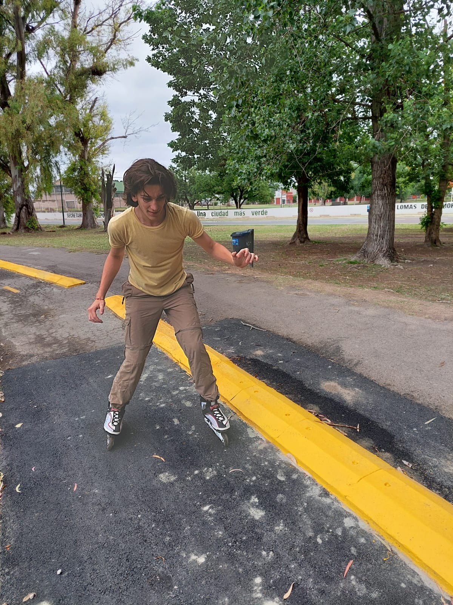

# Presentación - Alvarez Federico
### Legajo: 232.731-4
## Datos personales

Hola, soy Fede, tengo 20 años y amo los deportes, a pesar de que actualmente no estoy haciendo nada, hice basquet y voley. Ah, y soy re gordo compu, Valorant, Minecraft, Rocket o cualquier cosa. Ahora mismo estoy empezando el segundo año de la carrera (y una materia que me quedo del año pasado), estas son las que curso actualmente:

- Sintaxis y Semántica de los Lenguajes
- Paradigmas de Programación
- Álgebra y Geometría Analítica
- Análisis de Sistemas de Información

> **Nota:** A Álgebra y Geometría Analítica me anoté cuatrimestral, y si todo sale bien, en el segundo cuatrimestre me inscribiré a Fisica 2 en esos mismos horarios.

## Foto mia

#### Esta es una foto mia de cuano estaba apreniendo a andar en rollers

